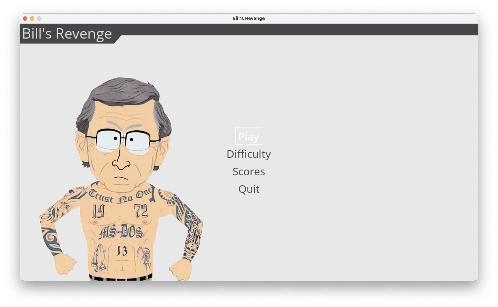
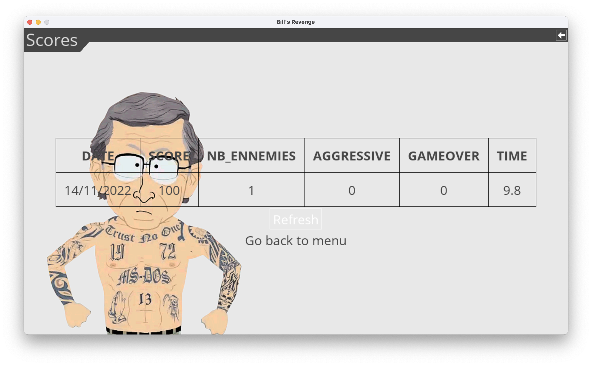
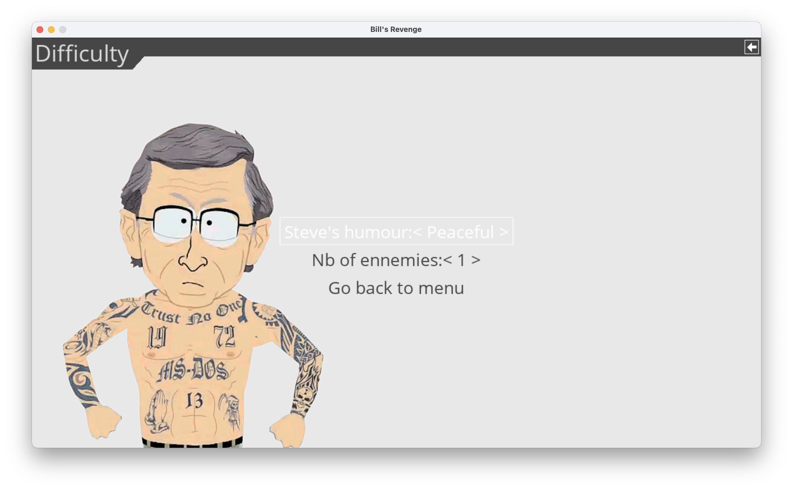

# Bill's Revenge

## Getting started

1. Download this repository
2. Open a terminal into the project directory
3. Run `pip install -r requirements.txt`
4. Launch the game with `python main.py`

## The main menu

This is the first window of the game. From here, you can start a new game of dive into the other submenu.

## The score menu 

All your greatest achievements (or failure) are referenced here.

## The difficulty menu

If you like the challenge, this menu will be your favorite. You can change the number of Steve Jobs that will appear on the map. You can also define if you want them to be aggressive or not. 

## The game

In the game, your objective is to beat up all the Steve Jobs that you can find on the map.

The controls:
+ `z`: Move the player up
+ `q`: Move the player to the left
+ `s`: Move the player down
+ `d`: Move the player to the right
+ `m`: Normal attack
+ `l`: Use bill's special attack